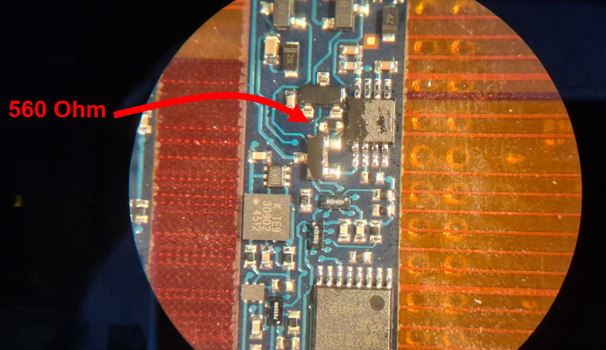
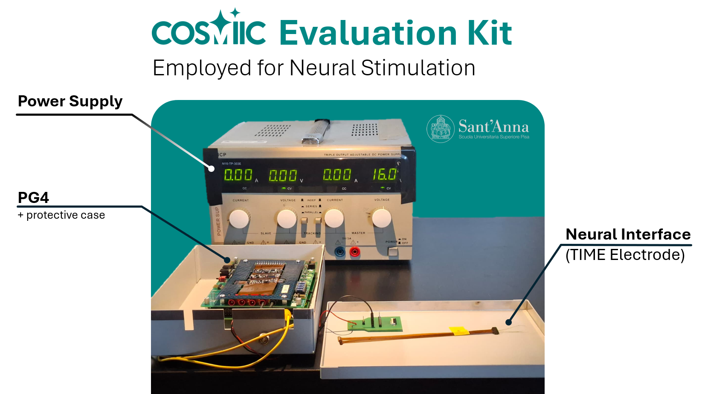
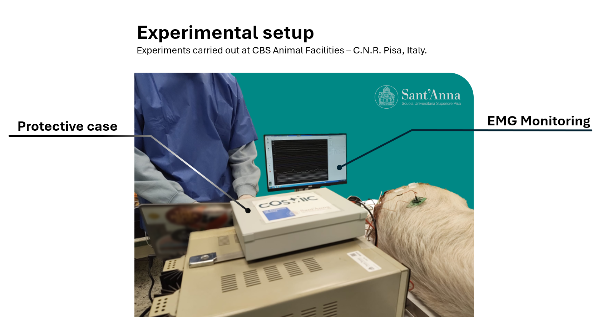
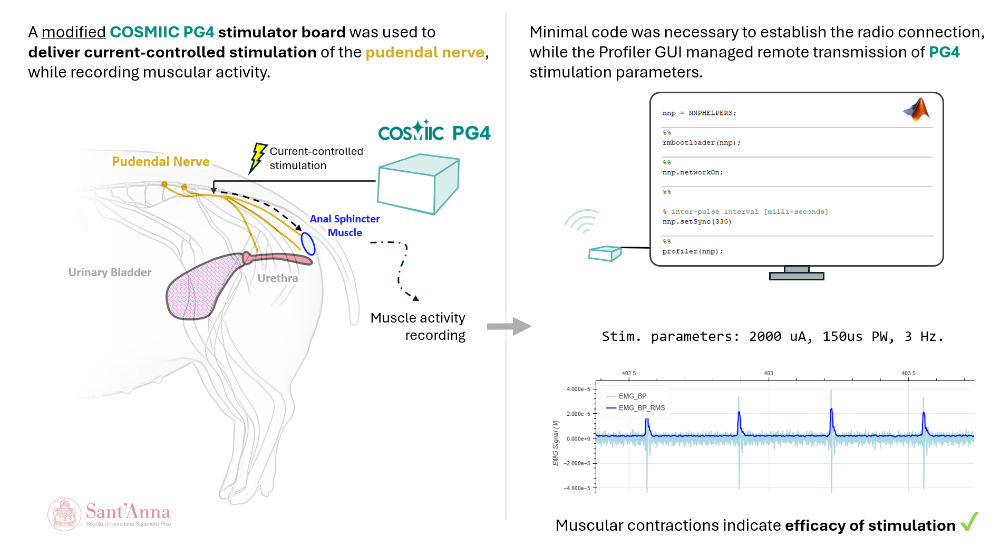

# Reduce Stimulation Amplitude

Adjust the stimulation amplitude to a lower range by replacing a resistor on the PG4 board.

---

## Overview

The Translational Neuro Engineering Lab at Scuola Superiore Sant'Anna is studying several neuromodulation techniques in animal models. Because these applications interface directly with the peripheral nervous system, they require lower stimulation levels and finer resolution than the original COSMIIC system design for muscular activation.

### Contributors

- Scuola Superiore Sant'Anna Lab: Filippo Castellani, Alice Gianotti, Francesco Iberite, Silvestro Micera
- COSMIIC team: Jerry Ukwela, Chris Rexroth

---

## Modifications

### Goal

The goal was to reduce the stimulation amplitude range from ```[1 mA - 20 mA]``` at 1 mA resolution to ```[100 uA - 2000 uA]``` at 100 uA resolution.

### Design Thinking

Given the PG4 version in use (PG4D module circuit, Revision B frame board) and the fact that the change is intended to be permanent, a hardware modification is more appropriate than a firmware change. Future versions of the PG4 should make amplitude-range adjustments easier to implement in firmware.


Start with the circuit schematics of the PG4 module in the [**Implantables-PG4-Hardware**](https://github.com/COSMIIC-Community/Implantables-PG4-Hardware) repository found on the COSMIIC GitHub. The picture above shows the stimulation output stage and has R67 circled. The current output is based on an input voltage divided by that R67. The current range and resolution will scale inversely with changes made to R67. To scale the current amplitude range down by 10, R67 was swapped with a 56 &Omega; x 10 = 560 &Omega; resistor. The next version of the PG4 (PG4E module circuit) will be easier to make firmware changes and use the full resolution of the DAC. That will be ready in late 2026.


> View of that resistor's location, highlighted in red, using a `.pcbdoc` viewer. Metadata confirms that it is a 56 &Omega; resistor.

### Completed Modification



> View of the board location after successfully removing the 56 &Omega; SMD resistor and replacing with a 560 &Omega; resistor.

### Forks of Repository

No modifications were made to the firmware or hardware repositories for the modules involved.

---

## Application

While the PG4 stimulation output was originally designed for muscular stimulation (relatively high stimulation thresholds), the team at the Translational Neuro Engineering Lab at Scuola Superiore Sant'Anna customized their PG4 module specifically for new peripheral neuromodulation applications requiring lower output and finer amplitude control.



The modified PG4 was used in a preliminary animal experiment to test its performance in vivo. The experiment involved stimulating the pudendal nerve of a pig (*Sus Scrofa Domesticus*) and recording the resulting muscle activity of the External Anal Sphincter. The stimulation was delivered through a TIME (Transverse Intrafascicular Multichannel Electrode). The Electromyographic (EMG) signals were recorded using needle electrodes placed percutaneously in the muscle.



Preliminary results showed the ability to evoke muscle activity with the modified PG4.



Further experiments are needed to fully characterize the performance of the modified PG4 as compared to standard stimulation devices.

---

## Attributions

Supported by the NIH SPARC HORNET program, the Case Western Reserve University team is funded by main award U41NS129436-03 and is interacting with the Scuola Superiore Sant'Anna as an early adopter.
